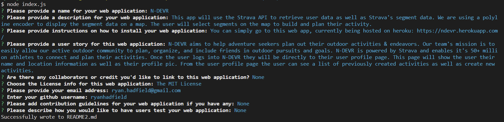
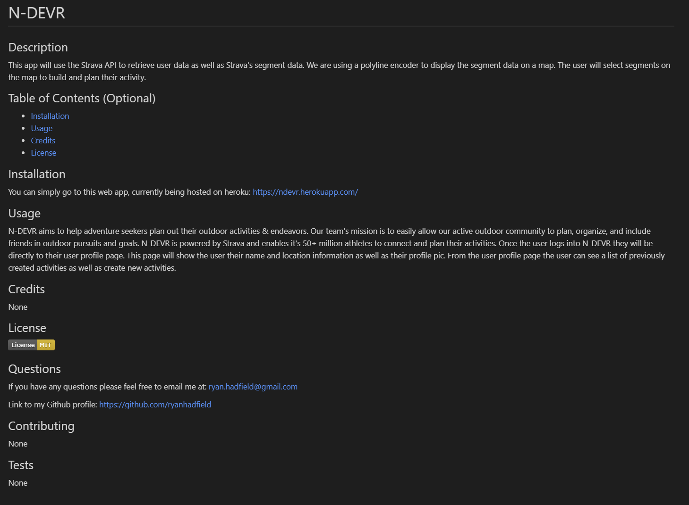

# Professional README Generator

## Description

When creating an open source project on GitHub, it’s important to have a high-quality README for your app. This should include what the app is for, how to use the app, how to install it, and how to report issues.

You can quickly and easily create a README file by using this command-line application to generate one. This allows the project creator to devote more time to working on the project.

Link to walk-through [video](https://drive.google.com/file/d/1vFo1V3kMbDpaK6gI7vOLFfnNhhLBGBvj/view) of how to use this app. 

---

## Table of Contents (Optional)

- [Installation](#installation)
- [Usage](#usage)
- [Credits](#credits)
- [License](#license)

---

## Installation

- In order to run this application you'll need to make sure you have [NodeJS](https://nodejs.org/en/) installed on your computer.
- You can run this app through the integrated terminal in your [Visual Studio Code (VS CODE)](https://code.visualstudio.com/).
- You'll need to make sure you have the package.json, index.js, and gitignore files from the github in the same folder on your computer.
- Once you have the integrated terminal open in VS code, run an "npm i" in the terminal.
- This should install a package-lock.jason file and node_modules.
- From here you'll want to type "node index.js" in your integrated terminal to initiate the application.

---

## Usage

You can quickly and easily create a README file by using this command-line application to generate one.

Once the application has been installed and initiated as per the above instructions you'll be prompted with a series of questions in your integrated terminal. Please fill out each of these questions and at the end of the questions you'll have a quality README file.

---

## License

MIT License 

---

## Badges

---

## Questions

Github: https://github.com/ryanhadfield

Email: Ryan.Hadfield@gmail.com